# ScatterViT : X-Ray Synchrotron Image Classification Pipeline

🔬 **A comprehensive self-supervised learning pipeline for automatic classification of X-ray scattering images from synchrotron facilities using DINOv2 foundation models.**


## 🌟 Features

- **🎯 Multi-Label Classification**: Supports 14 predefined attribute types for X-ray images
- **🚀 Self-Supervised Learning**: Implements DINO-style SSL with both standard and DeepSpeed variants
- **⚡ Parameter-Efficient Fine-tuning**: Uses LoRA for efficient adaptation with frozen backbone
- **🔬 X-Ray Specific Preprocessing**: Beam-stop masking, dead-pixel correction, radial normalization
- **📊 Comprehensive Metrics**: Hamming accuracy, subset accuracy, micro/macro F1-scores
- **🏗️ Modular Design**: Clean, extensible codebase with proper separation of concerns


## 📝 To Do

### Basic 
- [ ] Distributed Training with DeepSpeed &/ FSDP
- [ ] Build a baseline for classification with Resnet-34

### Extensions
- [ ] MAEpre-training for texture-rich diffraction rings in place of DINOv2
- [ ] CLIP-style multimodal model pairing images with textual metadata to leverage image text coreferences
 present in literature
- [ ] Pretrained encoding part of diffusion based models like Stable Diffusion
- [ ] SAM-style segmentation FM for peak localisation

### Ultimate
- [ ] Build a novel FM architecture from scratch by using physics informed neural network modules into each transformer that enforces physical equations as soft constraints and also accounts for scattering specific activations, rather than learn from statistical distribution of image features here.
- [ ] Use GRPO to optimize a physics-aware reward function to penalize labels violating scattering principles computing group-relative advantages to reinforce physically plausible classifications. 
- [ ] DiT based rare pattern synthesis to generate high resolution samples of rare patterns to be used in training

### Deployment
- [ ] ResNet baseline (- 3 ms/img GPU); FM only for less confident scores- softmax < τ (- 15 ms/img)
- [ ] INT8 quantisation and adapter pruning (30 %) cut memory if speed and effienciecy are the bottlenecks
- [ ] Active learning loop to collect highscoring samples at run time to add to the training data as soft inputs Semi Supervised learning.


## 📋 Table of Contents

- [Installation](#installation)
- [Quick Start](#quick-start)
- [Project Structure](#project-structure)
- [Pipeline Components](#pipeline-components)

## 🚀 Installation

### Prerequisites
- Python 3.8+
- CUDA-compatible GPU (recommended)
- 16GB+ RAM

### Setup Environment

```bash
# Clone the repository
git clone https://github.com/abhihash01/ScatterViT.git
cd ScatterViT

# Create virtual environment
python -m venv ScatterViT
source venv/bin/activate  

# Install dependencies
pip install -r requirements.txt
```

### Additional Setup for DeepSpeed (Optional)
```bash
# For DeepSpeed support
pip install deepspeed
```

## ⚡ Quick Start

### 1. Configure Your Data
Populate data in the format mentioned. Update it in the script files. 

### 2. Run the Complete Pipeline
```bash
# Run all components sequentially
python scripts/run_pipeline.py
```

### 3. Or Run Individual Components
```bash
# Baseline linear probe
python scripts/linear_probe_training.py

# Self-supervised learning (standard)
python scripts/self_supervised_training.py

# coming soon: Self-supervised learning with DeepSpeed
python scripts/ssl_deepspeed.py

# Parameter-efficient fine-tuning
python scripts/peft_finetune.py
```

## 📁 Project Structure

```
xray-synchrotron-classifier/
├── config/
│   ├── __init__.py
│   ├── config.yaml                          # Main configuration
│   ├── deepspeed_config.json                # DeepSpeed settings
├── src/
│   ├── data/
│   │   ├── dataset.py                       # Dataset classes - to be implemented based on the requirement
│   │   └── preprocessing.py                 # X-ray preprocessing
│   ├── models/
│   │   ├── dinov2_wrapper.py                # DINOv2 integration
│   │   ├── linear_probe.py                  # Linear/MLP probes
│   │   └── peft_model.py                    # LoRA models       
│   └── utils/
│       ├── metrics.py                       # Evaluation metrics
│       └── losses.py                        # Loss functions
├── scripts/
│   ├── preprocess_data.py                   # Data preprocessing - to be implemented based on the requirement
│   ├── linear_probe.py                      # Baseline training
│   ├── self_supervised_training.py          # Standard SSL
│   ├── ssl_deepspeed.py                     # DeepSpeed SSL - to be implemented
│   ├── peft_finetune.py                     # LoRA fine-tuning
│   └── run_pipeline.py                      # Complete pipeline
├── requirements.txt
└── README.md
```

## 🏗️ Architecture Overview

```mermaid
    flowchart LR
        %% INPUT
        A[Images<br/>from<br/>Synchrotron]
        A --> B[Pre-processing]

        %% BRANCH 1 ───── Probe pathway
        subgraph "Branch 1 • Probe"
            direction LR
            B --> C(Probe)
            C --> D1["Linear\nHead"]
            C --> D2["MLP\nHead"]
            D1 --> E1[Classification]
            D2 --> E1
        end

        %% BRANCH 2 ───── SSL + LoRA pathway
        subgraph "Branch 2 • SSL → LoRA"
            direction LR
            B --> F[Self-Supervised\nPre-training]
            F --> G[LoRA\nFine-tuning]
            G --> H[Classification]
        end

        %% STYLE ‑- optional tweaks
        classDef block fill:#f2f2f2,stroke:#333,stroke-width:1px;
        class A,B,C,D1,D2,E1,F,G,H block;
```




## 🧩 Pipeline Components

### 1. **Linear Probing (Baseline)**
- Extracts frozen DINOv2 features
- Trains linear and MLP classifiers
- Provides performance baseline

### 2. **Self-Supervised Learning**
- **Standard Training**: DINO-style teacher-student framework
- **DeepSpeed Training**: Memory-efficient distributed training with ZeRO
- Continues pretraining on unlabeled X-ray images

### 3. **Parameter-Efficient Fine-tuning**
- LoRA (Low-Rank Adaptation) implementation
- Freezes 90% of backbone parameters
- Optimized for multi-label classification

### 4. **X-Ray Preprocessing**
- Beam-stop masking for synchrotron data
- Dead pixel correction
- Logarithmic intensity transformation
- Radial normalization


## 🐛 Troubleshooting

### Common Issues

**CUDA Out of Memory**
- Reduce `batch_size` in config
- Enable `gradient_checkpointing`
- Use DeepSpeed with CPU offloading

**Slow Training**
- Increase `num_workers` for data loading
- Use mixed precision training (`fp16: true`)
- Consider DeepSpeed for multi-GPU training

**Poor Performance**
- Check data preprocessing pipeline
- Adjust learning rate and warmup steps
- Verify label format (multi-hot encoding)


## 🙏 Acknowledgments

- **Meta AI** for DINOv2 foundation models
- **Microsoft** for DeepSpeed optimization library
- **Hugging Face** for Transformers and PEFT libraries
- **Synchrotron facilities** worldwide for advancing X-ray science


---
